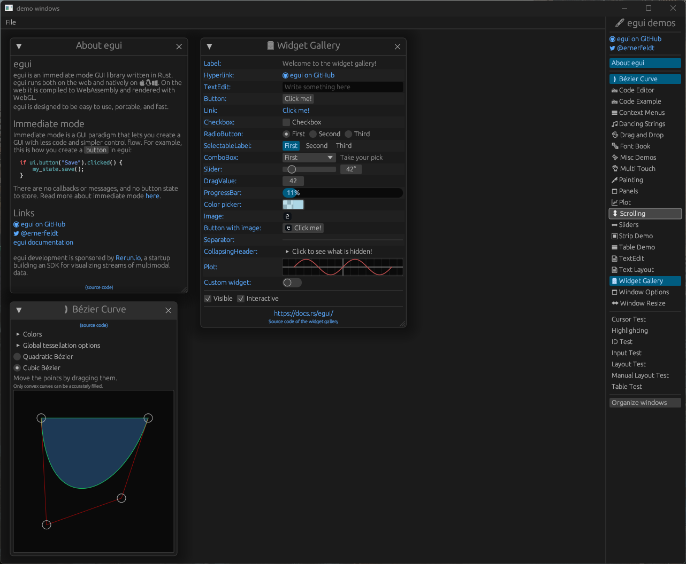

# egui-ash-renderer

[](https://crates.io/crates/egui-ash-renderer)
[](https://docs.rs/egui-ash-renderer)
[](https://github.com/adrien-ben/egui-ash-renderer/actions)
[](https://github.com/adrien-ben/egui-ash-renderer/actions)

A Vulkan renderer for [egui][egui] using [Ash][ash].

This is meant to add support for egui in your existing Vulkan/ash applications. Not a full eframe integration for Vulkan/ash.



## Compatibility

| crate  | egui | ash          | gpu-allocator (feature) | vk-mem (feature)                        |
|--------|------|--------------|-------------------------|-----------------------------------------|
| 1.0.0  | 0.26 | [0.34, 0.37] | 0.25                    | 0.3.0                                   |

## How it works

The renderer records drawing command to a command buffer supplied by the application. Here is a little breakdown of the features of this crate and how they work.

- Vertex/Index buffers

The renderer creates a vertex buffer and a index buffer that will be updated every time
`Renderer::cmd_draw` is called. If the vertex/index count is more than what the buffers can
actually hold then the buffers are resized (actually destroyed then re-created).

- Frames in flight

The renderer support having multiple frames in flight. You need to specify the number of frames
during initialization of the renderer. The renderer manages one vertex and index buffer per frame.

- No draw call execution

The `Renderer::cmd_draw` only record commands to a command buffer supplied by the application. It does not submit anything to the gpu.

- Managed textures

Textures managed by egui must be kept in sync with the renderer. To do so, the user should call `Renderer::set_textures` and 
`Renderer::free_textures`. The former must be call before submitting the command buffer for rendering and the latter must be
called after rendering is complete. Example:

```rust
let output = egui_ctx.run(raw_input, |ui| {
    // ui code ..
});

// before rendering the ui
renderer.set_textures(queue, command_pool, output.textures_delta.set.as_slice()).unwrap();

// rendering code goes here .. (calling cmd_draw, submitting the command buffer, waiting for rendering to be finished...)

// after the rendering is done 
renderer.free_textures(output.textures_delta.free.as_slice()).unwrap();
```

> If you have multiple frames in flight you might want to hold a set of textures to free for each frame and call 
`Renderer::free_textures` after waiting for the fence of the previous frame.

- Custom textures

You can also render used managed textures in egui. You just need to call `Renderer::add_user_texture` and pass a
`vk::DescriptorSet` compatible with the layout used in the renderer's graphics pipeline 
(see [create_vulkan_descriptor_set_layout](./src/renderer/vulkan.rs)). This will return a `egui::TextureId` that you
can use in your ui code. Example:

```rust
let user_texture_set: vk::DescriptorSet = ...;
let texture_id = renderer.add_user_texture(user_texture_set);

let output = egui_ctx.run(raw_input, |ui| {
    let egui_texture = SizedTexture {
        id: texture_id,
        size: Vec2 {
            x: 128.0,
            y: 128.0,
        },
    };

    egui::Image::new(egui_texture).ui(ui);
});

// When the texture won't be used anymore you can remove it from the renderer
renderer.remove_user_texture(texture_id);
```

You can find a example using egui managed and user managed textures [here](./examples/textures.rs).

## Features

### gpu-allocator

This feature adds support for [gpu-allocator][gpu-allocator]. It adds `Renderer::with_gpu_allocator` which takes
a `Arc<Mutex<gpu_allocator::vulkan::Allocator>>`. All internal allocator are then done using the allocator.

### vk-mem

This feature adds support for [vk-mem-rs][vk-mem-rs]. It adds `Renderer::with_vk_mem_allocator` which takes
a `Arc<Mutex<vk_mem::Allocator>>`. All internal allocator are then done using the allocator.

### dynamic-rendering

This feature is useful if you want to integrate the library in an app making use of Vulkan's dynamic rendering.
When enabled, functions that usually takes a `vk::RenderPass` as argument will now take a `DynamicRendering` which
contains the format of the color attachment the UI will be drawn to and an optional depth attachment format.

## Integration

You can find an example of integration with [winit][winit] in the [common module](examples/common/mod.rs) of the examples.

```rust
// Example with default allocator
let renderer = Renderer::with_default_allocator(
    &vk_instance,
    vk_physical_device,
    vk_device.clone(),
    vk_render_pass,
    Options::default(),
).unwrap();
```

## Examples

You can run a set of examples by running the following command:

```sh
# If you want to enable validation layers
export VK_LAYER_PATH=$VULKAN_SDK/Bin
export VK_INSTANCE_LAYERS=VK_LAYER_KHRONOS_validation

# Or with Powershell
$env:VK_LAYER_PATH = "$env:VULKAN_SDK\Bin"
$env:VK_INSTANCE_LAYERS = "VK_LAYER_KHRONOS_validation"

# If you changed the shader code (you'll need glslangValidator on you PATH)
# There is also a PowerShell version (compile_shaders.ps1)
./scripts/compile_shaders.sh

# Run an example
cargo run --example <example>

# Example can be one of the following value:
# - demo_windows
# - textures
```

[egui]: https://github.com/emilk/egui
[ash]: https://github.com/MaikKlein/ash
[gpu-allocator]: https://github.com/Traverse-Research/gpu-allocator
[vk-mem-rs]: https://github.com/gwihlidal/vk-mem-rs
[winit]: https://github.com/rust-windowing/winit
